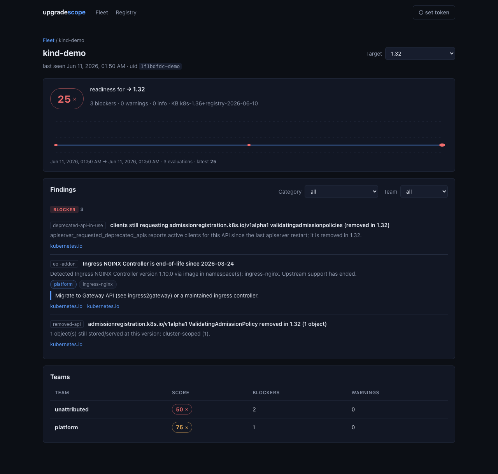

# upgradescope

Answers one question, continuously, for a live cluster or a directory of rendered manifests: **what breaks when this cluster moves to Kubernetes 1.38?** Removed APIs still in use, add-ons past end-of-life, version skew outside policy, Helm charts that do not support the target — as a deterministic score, a SARIF document for CI, and a `ClusterReadiness` object in the cluster.

[](https://github.com/abd-ulbasit/upgradescope/actions/workflows/ci.yml) [](https://github.com/abd-ulbasit/upgradescope/releases) [](https://goreportcard.com/report/github.com/abd-ulbasit/upgradescope) [](LICENSE)

```sh
upgradescope scan --target 1.36   # 0.22–0.30 s wall against the kind demo cluster (3 runs, 2026-06-11)
```

**It is not an operator, and that is the load-bearing design decision.** The verdict is a
function of (cluster inventory, knowledge base, target version) — and two of those three
change with **no Kubernetes event at all**: the knowledge base moves when the binary is
upgraded or the weekly registry refresh lands, the target moves when a new minor ships
upstream. A watch-driven reconciler would requeue on unrelated pod churn and still not
re-run on the day ingress-nginx's EOL date passes. So the agent is a jittered polling tick
with an idempotent status write under `RetryOnConflict` — no controller-runtime, no informer
cache over every API group, no leader election, no webhooks. The full argument, including the
read-cost comparison against an informer cache, is in
[Design boundaries](#design-boundaries).

Every add-on EOL claim carries an upstream citation, enforced by `registry.Validate` rather
than by review discipline; the API-lifecycle dataset is generated from `k8s.io/api` source
and CI fails when the committed copy drifts. Every number in this README is dated and says
how it was measured — see [Measured numbers](#measured-numbers).


> v0.1: point-in-time scan, continuous in-cluster agent + `ClusterReadiness` CRD, self-hosted server (SQLite/Postgres) with an embedded web dashboard, fleet rollups, per-team scores, CI gate + GitHub Action, CSV/HTML auditor exports, and a cited add-on registry kept in sync with upstream EOL data.

## Install

```sh
go install github.com/abd-ulbasit/upgradescope/cmd/upgradescope@latest
```

## Quickstart

```sh
# Scan the current kubeconfig context for readiness against Kubernetes 1.36
upgradescope scan --target 1.36

# Machine-readable report
upgradescope scan --target 1.36 --output json

# CI annotation: SARIF output + gate (exit 2 if any blocker, exit 1 on error)
upgradescope scan --target 1.36 --output sarif --fail-on blocker > scan.sarif

# Offline / CI: scan rendered manifests instead of a live cluster
upgradescope scan --target 1.36 --files ./rendered-manifests
```

Exit codes: `0` ready (or below `--fail-on` threshold), `1` scan error, `2` gate failed.

### The readiness score

The score is deterministic and explainable — same inventory, same knowledge base, same number:

```
score = max(0, 100 − min(75, 25 × blockers) − min(20, 5 × warnings))
ready = (blockers == 0)        # what --fail-on blocker gates on
```

Blockers are findings that break at the target version (a removed API in use, an EOL add-on);
warnings break one version later or are approaching EOL; info findings are listed but never
scored. Caps keep one noisy category from zeroing the score.

## Continuous mode

Run the agent in-cluster via the Helm chart — it keeps a `ClusterReadiness` resource up to date and (optionally) pushes to a self-hosted server:

```sh
helm install upgradescope ./deploy/chart -n upgradescope --create-namespace \
  --set server.enabled=true        # single-cluster all-in-one

kubectl get ucr                    # ClusterReadiness: TARGET / SCORE / READY
curl -s $SERVER/api/v1/clusters    # fleet API: clusters, findings, history, what-if (?target=1.38)
```

- Agent RBAC is cluster-wide **`get`/`list`/`watch` only**. The only things it
  ever writes are the `ClusterReadiness` CRD registration and its own
  `ClusterReadiness` object plus that object's `status` subresource
  (`deploy/chart/templates/rbac.yaml`). No webhooks, no finalizers, nothing in
  your cluster changes because of a finding.
- Works with no server at all — the CRD status is written every tick regardless
  of whether the server is reachable.
- Version-skew checks cover kubelet, HA apiserver spread, controller-manager/scheduler, and kube-proxy; kubectl skew is out of scope by design — client versions only appear in apiserver audit logs, which upgradescope never reads.
- Server: single binary + SQLite or Postgres. Slack/webhook notifications fire
  on *changes* only — a blocker that appeared since the previous evaluation, a
  warning that newly entered its approaching-EOL window, or a cluster that went
  from blocked to ready. Unchanged findings never re-alert (identity is a
  count-free finding key, so "3 objects" → "2 objects" is not a new event).
- Auth: bearer tokens (`--ingest-token`, optional `--read-token`).

> Integration tests are env-gated: `make demo-up && make it`; full agent e2e: `make agent-e2e` (kind + Helm + Docker required).

## Fleet mode

With several clusters pushing to one server, the read API rolls them up:

```sh
# Cluster × target score matrix (latest stored evaluations; no recompute)
curl -s "$SERVER/api/v1/fleet?targets=1.37,1.38"

# Per-team rollup across the fleet: worst score, total blockers, affected clusters
curl -s "$SERVER/api/v1/fleet/teams?target=1.38"

# Per-team scores for one cluster (also embedded as `teams` in /report)
curl -s "$SERVER/api/v1/clusters/1/teams?target=1.38"
```

Team attribution comes from namespace labels (`--team-label`, default `team`),
optionally overridden server-side with `serve --team-map teams.yaml`:

```yaml
# first matching glob wins; namespaces matching nothing keep their label
- pattern: "payments-*"
  team: payments
- pattern: "kube-*"
  team: platform
```

The CLI table output grows a `TEAMS` section whenever at least one finding is
attributed to a named team.

## Dashboard

`serve` embeds a web dashboard at `/`: the fleet score matrix, per-cluster
drill-down (findings with category/team filters, score trend, team table),
and a browser for the add-on registry this binary evaluates against
(`GET /api/v1/registry`).



```sh
make web && make build      # build the SPA, stage it for go:embed, build the binary
./bin/upgradescope serve --ingest-token $TOKEN
# open http://localhost:8080/
```

- No runtime JS dependencies beyond react/react-dom; charts are hand-rolled SVG.
- If the server runs with `--read-token`, set the token in the dashboard
  header (stored in browser localStorage, sent as a bearer header).
- Without `make web` the binary still builds and serves the API; `go build
  -tags nodashboard` skips the embed entirely.
- Dashboard dev loop: `cd web && npm run dev` (Vite proxies `/api` to `:8080`).

## CI gate

Two ways to block a PR that adds a removed API:

**1. CLI (no server needed):**

```sh
helm template ./chart > rendered.yaml   # or kustomize build
upgradescope scan --files . --target 1.38 --output sarif --fail-on blocker > results.sarif
```

**2. Server gate endpoint** — evaluates manifests *inside a known cluster's
context* (its add-ons, version skew, and namespace→team labels are merged in;
the manifests replace the cluster's API usage):

```sh
curl -sf -X POST "$SERVER/api/v1/gate?target=1.38&cluster=prod-eu-1&format=sarif" \
  -H "Authorization: Bearer $READ_TOKEN" \
  -H "Content-Type: application/x-yaml" \
  --data-binary @rendered.yaml > results.sarif
```

Omit `cluster=` to evaluate the manifests standalone; `format=json` (default)
returns the full report.

**GitHub Action** (composite, in `action/`):

```yaml
jobs:
  upgrade-gate:
    runs-on: ubuntu-latest
    permissions:
      security-events: write   # for SARIF upload
    steps:
      - uses: actions/checkout@v4
      - run: helm template ./chart --output-dir rendered
      - uses: abd-ulbasit/upgradescope/action@main
        id: gate
        with:
          path: rendered
          target: "1.38"
          fail-on: blocker
      - uses: github/codeql-action/upload-sarif@v3
        if: always()           # annotate the PR even when the gate fails
        with:
          sarif_file: ${{ steps.gate.outputs.sarif-file }}
```

## Auditor export

One self-contained artifact per cluster per target — no JS, no CDN, prints cleanly:

```sh
# findings as CSV (one row per finding, citations included)
curl -s "$SERVER/api/v1/clusters/1/export?target=1.38&format=csv" -o report.csv

# single-file HTML report: score badge, findings by severity, score-history sparkline
curl -s "$SERVER/api/v1/clusters/1/export?target=1.38&format=html" -o report.html
```

Exports always reflect the latest **stored** evaluation (what the system
actually recorded, with its `evaluatedAt`), never an on-the-fly recompute.

## Ingest tokens

- Dev / single cluster: one shared `serve --ingest-token <secret>` for all agents.
- Fleet: per-cluster tokens — `upgradescope tokens create <cluster> --db ...`
  prints a token (once) valid **only** for that cluster name (403 on mismatch);
  revoke with `upgradescope tokens revoke <cluster>`. The shared `--ingest-token`
  keeps working as a back-compat/dev path.
- Postgres backend: `serve --db-url postgres://...` (mutually exclusive with `--db`).

## The problem

Upgrading a Kubernetes cluster safely requires answering, *continuously*, questions that today are answered by one-shot CLIs or expensive commercial tools:

- Which workloads still use APIs that are deprecated or **removed** in my target version?
- Which of my add-ons (controllers, CRDs, charts) are **end-of-life or unmaintained** — e.g. teams that missed that Ingress NGINX hit EOL in March 2026 and now fail compliance scans?
- Is my version skew (kubelets vs control plane vs clients) within policy?
- Are my Helm releases compatible with the target Kubernetes version?
- Can I prove all of the above to a compliance auditor, per team, over time?

Open-source answers (pluto, kubent) are **point-in-time CLI scans** that depend on where manifests live and require manual wiring into CI. The continuous, in-cluster, fleet-aware version of this is commercial-only.

That last claim is not an assertion: the tool-by-tool evidence, with links, is in
[`docs/research.md`](docs/research.md) — which also carries the disclosure that belongs next
to it. **I interned at chkk.io, which sells in this category. upgradescope is clean-room: no
proprietary code, data, schemas, or internal documents were used or consulted.** Every entry
in the knowledge base is either generated from upstream `k8s.io/api` source or carries a
public citation URL, and CI checks both — so the claim is auditable rather than a promise.

## What upgradescope is

A self-hosted service + in-cluster agent that **continuously** watches what actually runs in your clusters, evaluates it against a curated knowledge base (API deprecations/removals per Kubernetes version, add-on EOL data, chart compatibility), and produces:

- a **readiness score per cluster per target version**, broken down by team/namespace,
- a live findings feed (what breaks at 1.37? what's EOL today?),
- compliance-friendly reports and a CI gate webhook ("block this PR — it adds a removed API").

## Architecture

One binary, three subcommands, one pure evaluation core embedded everywhere:

```
                    knowledge base (versioned with the code)
                    ├── internal/kb/data/apilifecycle.json   ← gen-kb ← k8s.io/api source
                    └── registry/data/*.yaml (cited)         ← eol-sync ← endoflife.date API
                                      │
                                      ▼
   CLI / CI                engine.Evaluate(inventory, kb, target) → report
   ───────────             (pure, deterministic, golden-file tested)
   upgradescope scan ──────────┐      ▲      ┌────────────────────────────────┐
   (kubeconfig or --files,     │      │      │ in-cluster (Helm chart)        │
    table/json/sarif,          │      └──────│ upgradescope agent             │
    exit codes for gating)     │             │  · read-only collectors       ─┼─► apiserver,
                               │             │  · ClusterReadiness CRD status │   metrics, Helm
                               ▼             └───────────────┬────────────────┘
                        ┌─────────────────────────┐          │ push (bearer token,
                        │ upgradescope serve      │◄─────────┘  per-cluster)
                        │  SQLite / Postgres      │
                        │  /api/v1: fleet matrix, │
                        │  reports, history, gate,│
                        │  CSV/HTML export        │
                        └─────────────────────────┘
```

The agent degrades gracefully: each collector (objects, apiserver metrics,
Helm, nodes) fails independently and the report says what it could not see.

## Design boundaries

**This is not an operator, and that is deliberate.** There is no
controller-runtime or kubebuilder dependency in `go.mod` — no manager, no
informer cache, no workqueue, no reconciler, no leader election, no webhooks,
no finalizers or owner references. The agent (`internal/agent/agent.go`) is a
timer loop: one tick immediately at startup, then every `--interval` (default
10m, minimum 1m) with ±10% jitter so a fleet installed in one `helm install`
sweep does not thundering-herd the apiservers. A tick is
collect → `engine.Evaluate` once per target → write `ClusterReadiness.status`
→ push the inventory snapshot to the server only if its canonical hash changed
since the last successful push (or `--force-sync-every`, default 1h, has
elapsed). Ticks never fail the loop: sub-collector errors become
`capabilities[x].available=false` with a reason, and a whole failed tick is
logged with a consecutive-failure count and retried on the next interval. The
single replica runs without leader election because the tick is idempotent and
the status write goes through `RetryOnConflict` — a second agent would compute
the same status from the same cluster, and any lost write is corrected one
interval later.

**Why a reconciler would be the wrong shape here.** A controller earns its
machinery by *actuating*: it converges the world toward a spec, so it needs
level-triggered watches, a rate-limited workqueue, and ownership semantics.
upgradescope actuates nothing — a finding is a report, not a desired state, and
`ClusterReadiness` is a status projection whose only user input is
`spec.targets`. Worse, watches would be pointed at the wrong inputs: the verdict
is a function of (cluster inventory, knowledge base, target version), and two of
those three change with **no Kubernetes event at all** — the KB is compiled into
the binary and moves when the binary is upgraded or the weekly registry refresh
lands, and the target moves when a new minor ships upstream. A watch-driven
reconciler would requeue on every unrelated pod churn and still not re-run on
the day ingress-nginx's EOL date passes. The read cost points the same way: an
informer cache over every API group holds memory proportional to the whole
cluster, whereas each tick issues bounded, paged (`limit=500`),
**metadata-only** lists restricted to the group/versions the KB flags as
deprecated. For a question whose answer is measured in calendar weeks, ten
minutes of staleness is free and a full-fidelity cache is not. Finally, the
fleet answers — cross-cluster rollups, score history, auditor exports — cannot
live in CRD status at all; they need a database, which is why the server owns
them and the CRD is only the per-cluster projection for `kubectl get ucr` and
for GitOps/policy tooling that should not have to reach the server.

### Managed clusters (EKS/GKE/AKS)

Zero config — point `scan` or the agent at a managed cluster and it works.
What changes because the provider owns the control plane:

- **Deprecated-calls metric degrades** — providers often block the
  apiserver `/metrics` endpoint regardless of your RBAC. The capability is
  then reported as unavailable with the reason
  `apiserver /metrics forbidden (managed control planes often block this; …)`.
  You lose the *active caller* signal (who is still hitting a deprecated
  API); the static signal (which deprecated/removed objects exist) is
  unaffected.
- **Control-plane pods are absent** from `kube-system` on managed
  offerings. This costs nothing: version skew is always computed from the
  API server version and node kubelet versions, never from control-plane
  pods.

Everything else — object inventory, API lifecycle findings, add-on EOL,
Helm chart compatibility, scoring, CRD status, server push — works
identically on managed and self-managed clusters.

## Measured numbers

Measured 2026-06-11 on an Apple-silicon MacBook (Docker via Colima), against
the kind demo cluster (single node, Kubernetes v1.35, demo workloads + EOL
ingress-nginx installed):

| What                                                              | Measured                          |
|-------------------------------------------------------------------|-----------------------------------|
| `upgradescope scan --target 1.36` against the live demo cluster   | 0.22–0.30 s wall (3 runs)         |
| Release binary, darwin/arm64 (`-ldflags "-s -w"`)                  | 52 MB (75 MB unstripped)          |
| Docker image (multi-stage, distroless static, nonroot)             | 47 MB                             |
| API lifecycle dataset                                              | 160 entries from k8s.io/api v0.36.1 |
| Add-on registry                                                    | 18 add-ons, every claim cited     |

## The knowledge base stays fresh by itself

- `tools/gen-kb` regenerates the API lifecycle dataset by type-asserting every
  registered `k8s.io/api` type against the generated `APILifecycleIntroduced` /
  `Deprecated` / `Removed` / `Replacement` methods — the same source of truth
  the apiserver compiles in, never a hand-copied table. CI (`kb-freshness`)
  reruns the generator on every push and fails if the committed dataset differs,
  and separately diffs the generator's import list against `go list
  k8s.io/api/...` so a new group/version cannot be silently missed.
- `tools/eol-sync` reconciles the 10 of 18 registry entries that declare an
  `endoflife_product` slug against the live endoflife.date API; `make eol-check`
  fails a PR that touches `registry/` when the committed dates have drifted. The
  remaining 8 entries have no endoflife.date product and are hand-curated
  against the citations in the entry.
- A weekly GitHub Actions cron (`kb-refresh.yml`, Mondays 06:17 UTC) bumps
  `k8s.io/api`, reruns both tools, and opens a reviewable PR — no silent
  dataset changes.

Want to add an add-on? See [`registry/CONTRIBUTING.md`](registry/CONTRIBUTING.md).

## How it compares

| | pluto | kubent | upgradescope |
|---|---|---|---|
| Deprecated/removed API detection | manifests in repos | live cluster, one-shot | live cluster + manifests |
| Detects *clients still calling* deprecated APIs | — | — | ✅ (apiserver metrics, where exposed — see [Managed clusters](#managed-clusters-eksgkeaks)) |
| Add-on EOL detection (e.g. ingress-nginx) | — | — | ✅ (curated, cited registry) |
| Version-skew checks | — | — | ✅ |
| Helm chart ↔ K8s compatibility | — | — | ✅ |
| Readiness score (deterministic, per target) | — | — | ✅ |
| SARIF output for code-scanning annotation | — | — | ✅ |
| Continuous, in-cluster | — | — | ✅ (agent + CRD + server) |
| Fleet rollups, team scores, auditor export | — | — | ✅ |

Two things the table deliberately does not claim: pluto and kubent both support
CI exit codes, so "fails your pipeline" is not a differentiator — the score and
the SARIF document are. And both remain the better fit when all you want is one
`detect-files` run over a repo; upgradescope is heavier because it is aimed at
the always-on, fleet-wide question.

Every EOL claim in the knowledge base carries an upstream citation URL — auditable, not a black box. Citations are enforced by `registry.Validate`, not by review discipline: an entry whose `support.status` is anything but `unknown`, and every `compat` entry, fails validation with zero citations. The API lifecycle dataset is generated from upstream `k8s.io/api` source, not hand-copied.

Where the commercial comparison comes from, and the chkk.io disclosure that goes with it:
[`docs/research.md`](docs/research.md).

## License

Apache-2.0.
